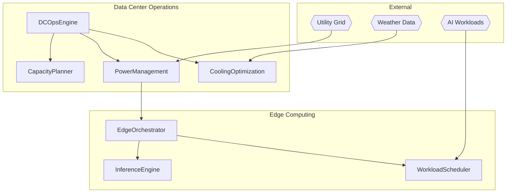
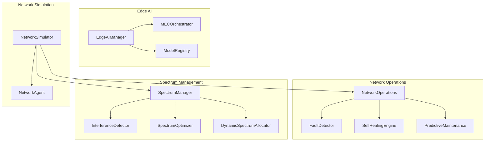
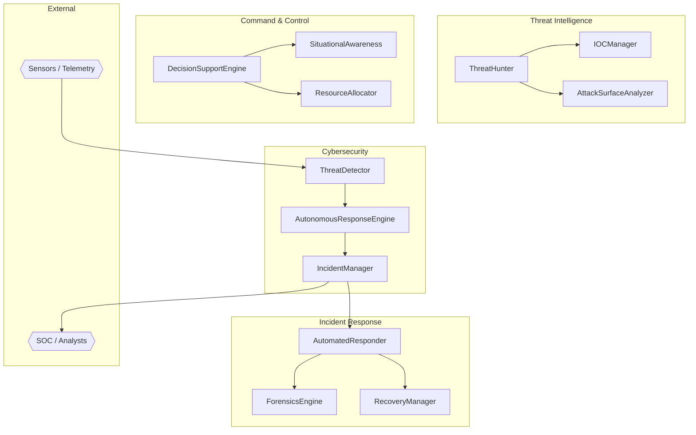

# Apex Critical Infrastructure

**Agentic AI Systems for Critical Infrastructure**

A comprehensive Python framework for autonomous decision-making across critical infrastructure domains — power grids, data centers, telecommunications, and defense/security operations. Built for agentic AI systems that require real-time situational awareness, predictive analytics, and autonomous response capabilities.

---

## Table of Contents

- [Project Overview](#project-overview)
- [Architecture](#architecture)
- [Features](#features)
- [API Reference](#api-reference)
- [Quick Start](#quick-start)
- [Related Projects](#related-projects)
- [FinTech C2 Matrix](#fintech-c2-matrix)
- [License](#license)

---

## Project Overview

Apex Critical Infrastructure provides a modular, extensible Python library for agentic AI systems operating in critical infrastructure environments. The framework spans four primary domains:

| Domain | Modules | Purpose |
|--------|---------|---------|
| **Smart Grid** | `smart_grid`, `renewables`, `grid_simulator` | Autonomous grid balancing, demand forecasting, frequency/voltage regulation, renewable energy management |
| **Data Center** | `dc_operations`, `cooling_optimization`, `power_management`, `edge_computing` | Autonomous DC ops, cooling optimization, PUE management, distributed AI inference |
| **Telecom/Network** | `network_operations`, `spectrum_management`, `edge_ai`, `network_simulator` | Self-healing networks, dynamic spectrum allocation, MEC orchestration |
| **Defense/Security** | `cybersecurity`, `command_control`, `threat_intelligence`, `incident_response` | Threat detection, autonomous response, C2 decision support, forensics |

All modules are fully typed, documented, and raise explicit exceptions on invalid input or unrecoverable states. The framework integrates with the broader AAH20 ecosystem including Apex_ULL (ultra-low latency), ApexGraphSwarm (multi-agent orchestration), GRC_Claw (governance), and Data Center Commander (DC lifecycle).

---

## Architecture

### System Context

```mermaid
flowchart TD
    subgraph External["External Systems"]
        SCADA{{"SCADA / EMS"}}
        Weather{{"Weather APIs"}}
        ThreatIntel{{"Threat Feeds"}}
        NOC{{"NOC / SOC"}}
    end

    subgraph EntryPoints["Entry Points"]
        REST(("REST API"))
        CLI(("CLI Interface"))
        Agent(("Agent Runtime"))
    end

    subgraph Core["Apex Critical Infrastructure"]
        SmartGrid["Smart Grid"]
        Renewables["Renewables"]
        DC["DC Operations"]
        Cooling["Cooling Optimization"]
        Power["Power Management"]
        NetOps["Network Operations"]
        Spectrum["Spectrum Management"]
        EdgeAI["Edge AI"]
        Cyber["Cybersecurity"]
        C2["Command & Control"]
        ThreatIntelMod["Threat Intelligence"]
        IncidentResp["Incident Response"]
        GridSim["Grid Simulator"]
        NetSim["Network Simulator"]
    end

    subgraph Data["Data Layer"]
        TimeSeries[("Time-Series DB")]
        Topology[("Topology Store")]
        Events[("Event Log")]
    end

    SCADA --> SmartGrid
    Weather --> Renewables
    ThreatIntel --> ThreatIntelMod
    NOC --> Cyber

    REST --> SmartGrid
    CLI --> NetOps
    Agent --> C2

    SmartGrid --> TimeSeries
    Renewables --> TimeSeries
    DC --> TimeSeries
    NetOps --> Topology
    Spectrum --> Topology
    Cyber --> Events
    ThreatIntelMod --> Events
    IncidentResp --> Events

    GridSim --> SmartGrid
    GridSim --> Renewables
    NetSim --> NetOps
    NetSim --> Spectrum
```



### Smart Grid Subsystem

```mermaid
flowchart TD
    subgraph Grid["Smart Grid Control"]
        Controller["SmartGridController"]
        Balancer["GridBalancer"]
        FreqReg["FrequencyRegulator"]
        VoltCtrl["VoltageController"]
        Forecaster["Demand Forecaster"]
    end

    subgraph Renewable["Renewables Management"]
        RenController["RenewablesController"]
        Solar["ClearSkySolarForecaster"]
        Wind["PowerCurveWindForecaster"]
        Storage["StorageOptimizer"]
        Curtail["CurtailmentManager"]
    end

    subgraph Maintenance["Predictive Maintenance"]
        MaintController["PredictiveMaintenanceController"]
        Weibull["WeibullFailurePredictor"]
        Anomaly["StatisticalAnomalyDetector"]
        Scheduler["MaintenanceScheduler"]
    end

    subgraph Sim["Grid Simulation"]
        GridSim["GridSimulator"]
        Builder["GridBuilder"]
    end

    Controller --> Balancer
    Controller --> FreqReg
    Controller --> VoltCtrl
    Controller --> Forecaster

    RenController --> Solar
    RenController --> Wind
    RenController --> Storage
    RenController --> Curtail

    MaintController --> Weibull
    MaintController --> Anomaly
    MaintController --> Scheduler

    GridSim --> Controller
    GridSim --> RenController
    GridSim --> MaintController
    GridSim --> Builder
```



### Data Center Subsystem



### Network Operations Subsystem



### Defense & Security Subsystem



---

## Features

| Feature | Module | Description |
|---------|--------|-------------|
| Autonomous Grid Balancing | `smart_grid` | Real-time generation-load balancing with economic dispatch |
| Demand Forecasting | `smart_grid` | Multi-horizon load prediction with confidence intervals |
| Frequency Regulation | `smart_grid` | Automatic generation control with droop response |
| Voltage Control | `smart_grid` | Reactive power management and tap changer control |
| Solar Forecasting | `renewables` | Clear-sky and cloud-adjusted solar irradiance prediction |
| Wind Forecasting | `renewables` | Power-curve-based wind generation forecasting |
| Storage Optimization | `renewables` | Battery charge/discharge optimization with degradation modeling |
| Curtailment Management | `renewables` | Renewable curtailment with economic impact assessment |
| Equipment Failure Prediction | `predictictive_maintenance` | Weibull-based remaining useful life estimation |
| Anomaly Detection | `predictictive_maintenance` | Statistical process control for sensor data |
| Maintenance Scheduling | `predictictive_maintenance` | Priority-based maintenance task scheduling |
| Grid Simulation | `grid_simulator` | Real-time grid simulation with AI decision-making |
| DC Operations | `dc_operations` | Autonomous data center operations and capacity planning |
| Cooling Optimization | `cooling_optimization` | HVAC, liquid cooling, and free cooling optimization |
| Power Management | `power_management` | UPS, generator, and renewable integration with PUE optimization |
| Edge Computing | `edge_computing` | Distributed AI inference and workload orchestration |
| Self-Healing Networks | `network_operations` | Automatic fault detection and remediation |
| Spectrum Management | `spectrum_management` | Dynamic spectrum allocation and interference detection |
| Edge AI | `edge_ai` | MEC orchestration and low-latency inference |
| Network Simulation | `network_simulator` | Real-time network simulation with agentic AI |
| Threat Detection | `cybersecurity` | Real-time threat detection with temporal correlation |
| Autonomous Response | `cybersecurity` | Automated response orchestration with approval gates |
| Incident Management | `cybersecurity` | Full incident lifecycle management with SLA tracking |
| Decision Support | `command_control` | Multi-criteria decision analysis for C2 |
| Situational Awareness | `command_control` | Real-time operational picture aggregation |
| Resource Allocation | `command_control` | Dynamic resource allocation with priority-based preemption |
| Threat Hunting | `threat_intelligence` | Proactive threat hunting with hypothesis tracking |
| IOC Management | `threat_intelligence` | Indicator of Compromise lifecycle management |
| Attack Surface Analysis | `threat_intelligence` | Continuous attack surface assessment |
| Automated Response | `incident_response` | Playbook-driven automated incident response |
| Digital Forensics | `incident_response` | Forensic evidence collection with chain of custody |
| Recovery Management | `incident_response` | System recovery orchestration with verification |

---

## API Reference

### Smart Grid

```python
from smart_grid import SmartGridController, Bus, Generator, Load, Line

# Create grid components
bus = Bus(bus_id="bus1", voltage_pu=1.0, bus_type="slack")
gen = Generator(gen_id="gen1", bus_id="bus1", p_min_mw=50.0, p_max_mw=300.0, current_output_mw=150.0, marginal_cost_per_mwh=40.0)
load = Load(load_id="load1", bus_id="bus2", active_power_mw=60.0)
line = Line(line_id="line12", from_bus="bus1", to_bus="bus2", rating_mva=200.0)

# Initialize controller
controller = SmartGridController()
controller.add_bus(bus)
controller.add_generator(gen)
controller.add_load(load)
controller.add_line(line)

# Process snapshot
snapshot = controller.create_snapshot()
results = controller.process_snapshot(snapshot)
```

### Renewables

```python
from renewables import RenewablesController, RenewableAsset, RenewableType, StorageSystem, StorageType

controller = RenewablesController()

# Add renewable assets
solar = RenewableAsset(asset_id="solar_1", asset_type=RenewableType.SOLAR, capacity_mw=80.0, current_output_mw=40.0, location_lat=40.0, location_lon=-105.0)
wind = RenewableAsset(asset_id="wind_1", asset_type=RenewableType.WIND, capacity_mw=120.0, current_output_mw=60.0, location_lat=41.0, location_lon=-104.0)
controller.add_asset(solar)
controller.add_asset(wind)

# Add storage
storage = StorageSystem(storage_id="battery_1", storage_type=StorageType.LITHIUM_ION, capacity_mwh=200.0, max_power_mw=50.0, round_trip_efficiency=0.92, current_soc_mwh=100.0)
controller.add_storage(storage)

# Get forecasts
forecast = controller.forecast(horizon_hours=24)
```

### Predictive Maintenance

```python
from predictive_maintenance import PredictiveMaintenanceController, Equipment, EquipmentType, SensorReading

controller = PredictiveMaintenanceController()

# Add equipment
transformer = Equipment(equipment_id="tx_1", equipment_type=EquipmentType.TRANSFORMER, name="Main Transformer", installation_date=datetime.now() - timedelta(days=365*10), expected_lifetime_years=30.0, health_index=0.75, criticality=0.9)
controller.add_equipment(transformer)

# Add sensor readings
reading = SensorReading(sensor_id="tx_1_temp", equipment_id="tx_1", timestamp=datetime.now(), value=65.0, unit="C")
controller.add_sensor_reading(reading)

# Analyze equipment
result = controller.analyze_equipment("tx_1")
```

### Grid Simulator

```python
from grid_simulator import GridSimulator, SimulationConfig

config = SimulationConfig(duration_hours=24.0, time_step_seconds=60.0, random_seed=42)
simulator = GridSimulator(config=config)
simulator.setup_scenario("renewable")
result = simulator.run()
```

### Cybersecurity

```python
from cybersecurity import ThreatDetector, AutonomousResponseEngine, IncidentManager, SecurityEvent, ThreatLevel

detector = ThreatDetector()
response_engine = AutonomousResponseEngine()
incident_mgr = IncidentManager()

# Create and analyze event
event = SecurityEvent(source="firewall", event_type="intrusion_attempt", raw_data={"src_ip": "10.0.0.1"})
assessment = detector.analyze(event)

# Create incident
incident = incident_mgr.create_incident(title="Intrusion Attempt", description="Detected intrusion attempt from 10.0.0.1", severity=assessment.threat_level, category=ThreatCategory.INTRUSION)
```

### Command & Control

```python
from command_control import DecisionSupportEngine, SituationalAwareness, ResourceAllocator, DecisionOption, Resource, ResourceType

dse = DecisionSupportEngine()
sa = SituationalAwareness()
allocator = ResourceAllocator()

# Register resources
compute = Resource(name="GPU Cluster", resource_type=ResourceType.COMPUTE, capacity=100.0)
allocator.add_resource(compute)

# Evaluate options
option = DecisionOption(name="Deploy Reserve", criteria_scores={"effectiveness": 0.8, "speed": 0.9}, weights={"effectiveness": 0.5, "speed": 0.5}, risk_score=0.2)
ranked = dse.evaluate([option])
```

### Threat Intelligence

```python
from threat_intelligence import ThreatHunter, IOCManager, AttackSurfaceAnalyzer, IOCType, IOCConfidence

hunter = ThreatHunter()
ioc_mgr = IOCManager()
analyzer = AttackSurfaceAnalyzer()

# Add IOC
ioc_mgr.add_ioc(value="192.168.1.100", ioc_type=IOCType.IP, confidence=IOCConfidence.HIGH, source="threat_feed")

# Create hypothesis
hypothesis = hunter.create_hypothesis(description="Lateral movement detection", query="src_ip:192.168.1.100 AND dest_port:445")

# Scan attack surface
report = analyzer.scan(targets=["10.0.0.0/24"])
```

### Incident Response

```python
from incident_response import AutomatedResponder, ForensicsEngine, RecoveryManager, ResponsePlaybook, PlaybookTrigger

responder = AutomatedResponder()
forensics = ForensicsEngine()
recovery = RecoveryManager()

# Register playbook
playbook = ResponsePlaybook(name="Ransomware Response", trigger=PlaybookTrigger.THREAT_DETECTED, steps=[lambda ctx: True])
responder.register_playbook(playbook)

# Execute playbook
result = responder.execute(playbook.playbook_id, context={"threat": "ransomware"})
```

---

## Quick Start

### Prerequisites

- Python 3.10+
- No external runtime dependencies (standard library only)

### Installation

```bash
git clone https://github.com/AAH20/apex-critical-infra.git
cd apex-critical-infra
pip install -e .
```

### Running the Grid Simulator

```python
#!/usr/bin/env python3
"""Quick start: Run a 24-hour grid simulation."""

from grid_simulator import GridSimulator, SimulationConfig

def main():
    config = SimulationConfig(
        duration_hours=24.0,
        time_step_seconds=60.0,
        random_seed=42,
        enable_forecasting=True,
        enable_storage=True,
        enable_curtailment=True,
        enable_predictive_maintenance=True,
    )

    simulator = GridSimulator(config=config)
    simulator.setup_scenario("renewable")
    result = simulator.run()

    print(f"Simulation completed: {result.summary['total_steps']} steps")
    print(f"Frequency stable: {result.summary['frequency_stable_fraction']:.1%}")
    print(f"Voltage stable: {result.summary['voltage_stable_fraction']:.1%}")
    print(f"Average renewable: {result.summary['average_renewable_mw']:.1f} MW")
    print(f"Maintenance alerts: {result.summary['maintenance_alert_count']}")

if __name__ == "__main__":
    main()
```

### Running the Network Simulator

```python
#!/usr/bin/env python3
"""Quick start: Run a network simulation."""

from network_simulator import NetworkSimulator, SimulationConfig

def main():
    config = SimulationConfig(duration_hours=12.0, time_step_seconds=30.0)
    simulator = NetworkSimulator(config=config)
    result = simulator.run()
    print(f"Network simulation completed: {result.summary}")

if __name__ == "__main__":
    main()
```

### Running Tests

```bash
python -m unittest discover -s tests -v
```

---

## Related Projects

All projects by [@AAH20](https://github.com/AAH20) — Ahmed Hassan, Computer Scientist / Agentic AI Architect & Engineer / Cybersecurity & GRC.

### Core Apex Ecosystem

| Project | Description | URL |
|---------|-------------|-----|
| Apex_ULL | Ultra-Latency Library | https://github.com/AAH20/Apex_ULL |
| ApexGraphSwarm | Multi-Agent Orchestration | https://github.com/AAH20/ApexGraphSwarm |
| GRC_Claw | GRC Automation Engine | https://github.com/AAH20/GRC_Claw |
| Data Center Commander | DC Lifecycle Management | https://github.com/AAH20/Data-Center-Commander |
| Apex Memory Context | Agent Memory & Context | https://github.com/AAH20/Apex-Memory-Context |
| apex-kernel-mesh | Capability Discovery & DAG Planning | https://github.com/AAH20/apex-kernel-mesh |
| apex-mcp-foundry | MCP Capability Hypervisor | https://github.com/AAH20/apex-mcp-foundry |
| apex-mcp-gateway-kernel | MCP Gateway & Inference Router | https://github.com/AAH20/apex-mcp-gateway-kernel |
| apex-quant-whale-kernel | Quantitative Market Maker Kernel | https://github.com/AAH20/apex-quant-whale-kernel |

### Agent Infrastructure

| Project | Description | URL |
|---------|-------------|-----|
| hyper-agent-os | Agent Operating System | https://github.com/AAH20/hyper-agent-os |
| swarm-substrate | Swarm Substrate | https://github.com/AAH20/swarm-substrate |
| agent-immune-kernel | Agent Immune Kernel | https://github.com/AAH20/agent-immune-kernel |
| agent-trust-fabric | Agent Trust Fabric | https://github.com/AAH20/agent-trust-fabric |
| Swarm-Context-Commander | Agent Memory & Context Engineering | https://github.com/AAH20/Swarm-Context-Commander |
| swarm-desktop-os | Multi-Agent Virtual Desktop | https://github.com/AAH20/swarm-desktop-os |
| agent-action-gate | Gate/Prove Runtime for Agent Calls | https://github.com/AAH20/agent-action-gate |
| agentic-devops-sre-skill-registry | Agentic DevOps Skills | https://github.com/AAH20/agentic-devops-sre-skill-registry |

### Security & GRC

| Project | Description | URL |
|---------|-------------|-----|
| ai-cloud-cost-optimization-platform | Cloud Cost Optimization | https://github.com/AAH20/ai-cloud-cost-optimization-platform |
| agentproof-ai-security-scanner | AI Security Scanner | https://github.com/AAH20/agentproof-ai-security-scanner |
| vuln-triage | Exploit-Aware Vulnerability Triage | https://github.com/AAH20/vuln-triage |
| aiops-observability-platform | AIOps Observability | https://github.com/AAH20/aiops-observability-platform |
| mcp-redteam | Adversarial MCP Server Testing | https://github.com/AAH20/mcp-redteam |
| azure-trustops | Azure TrustOps | https://github.com/AAH20/azure-trustops |
| AAH_PostQuantum_Cryptography | Post-Quantum Crypto Toolkit | https://github.com/AAH20/AAH_PostQuantum_Cryptography |
| Aegis_CM_Swarm2 | AI Agent Swarm Demo | https://github.com/AAH20/Aegis_CM_Swarm2 |
| Aegis-Neuro-Biometric-Simulator | Multi-Modal Biometric Simulator | https://github.com/AAH20/Aegis-Neuro-Biometric-Simulator |
| Mobile-Security-Framework-MobSF | Mobile Security Framework | https://github.com/AAH20/Mobile-Security-Framework-MobSF |
| quark-engine | Android Malware Analysis | https://github.com/AAH20/quark-engine |
| gbox | AI Agent Sandbox | https://github.com/AAH20/gbox |
| tpotce | T-Pot Honeypot Platform | https://github.com/AAH20/tpotce |

### Infrastructure & Cloud

| Project | Description | URL |
|---------|-------------|-----|
| neuro-manifold | Neuromorphic Computing | https://github.com/AAH20/neuro-manifold |
| neuro-spatial | Neuromorphic Spatial Processing | https://github.com/AAH20/neuro-spatial |
| pqc-enclave | Post-Quantum Enclave | https://github.com/AAH20/pqc-enclave |
| zk-biometrics | Zero-Knowledge Biometrics | https://github.com/AAH20/zk-biometrics |
| cyborg-bench | Cyborg Benchmark | https://github.com/AAH20/cyborg-bench |
| sky-sentinel | Sky Sentinel | https://github.com/AAH20/sky-sentinel |
| edge-vision-mesh | Edge Vision Mesh | https://github.com/AAH20/edge-vision-mesh |
| multicloud-infrastructure-control-loop | Multi-Cloud Control Loop | https://github.com/AAH20/multicloud-infrastructure-control-loop |
| network-change-intelligence-twin | Network Change Intelligence | https://github.com/AAH20/network-change-intelligence-twin |
| azure-private-link-doctor | Azure Private Link Diagnostics | https://github.com/AAH20/azure-private-link-doctor |
| kubernetes-ai-finops-autopilot | K8s AI FinOps | https://github.com/AAH20/kubernetes-ai-finops-autopilot |

### Other Projects

| Project | Description | URL |
|---------|-------------|-----|
| freqtrade | Crypto Trading Bot | https://github.com/AAH20/freqtrade |
| Jesse | AI Trading Assistant | https://github.com/AAH20/jesse |
| CakeWallet-Analysis | BTC/Monero Wallet Analysis | https://github.com/AAH20/CakeWallet-Analysis |
| 100-redteam-projects | Security Student Projects | https://github.com/AAH20/100-redteam-projects |

---

## FinTech C2 Matrix

20-layer capability mapping for financial technology command-and-control operations.

| Layer | Capability | Apex Module | Description |
|-------|------------|-------------|-------------|
| 1 | **Market Data** | `edge_ai`, `edge_computing` | Real-time market data ingestion and distribution at the edge |
| 2 | **Order Management** | `command_control` | Order routing, execution management, and lifecycle tracking |
| 3 | **Risk Management** | `predictive_maintenance`, `threat_intelligence` | Real-time risk scoring, exposure monitoring, and limit enforcement |
| 4 | **Compliance** | `cybersecurity`, `incident_response` | Regulatory compliance monitoring, audit trails, and reporting |
| 5 | **Network Infrastructure** | `network_operations`, `network_simulator` | Low-latency network infrastructure with self-healing capabilities |
| 6 | **Payments** | `power_management`, `dc_operations` | Payment processing infrastructure with 99.99% uptime SLA |
| 7 | **Revenue Assurance** | `smart_grid`, `renewables` | Revenue optimization through predictive analytics and forecasting |
| 8 | **Growth Analytics** | `edge_ai`, `edge_computing` | Customer behavior analytics and growth metrics at the edge |
| 9 | **Arbitrage** | `grid_simulator`, `smart_grid` | Cross-market arbitrage detection and execution optimization |
| 10 | **DeFi** | `cybersecurity`, `threat_intelligence` | DeFi protocol security, smart contract monitoring, and threat detection |
| 11 | **Merchant** | `edge_computing`, `edge_ai` | Merchant payment processing and fraud detection at the edge |
| 12 | **AI Infrastructure** | `edge_ai`, `edge_computing` | Distributed AI inference infrastructure for financial models |
| 13 | **Cloud Infrastructure** | `dc_operations`, `cooling_optimization` | Cloud infrastructure optimization with PUE and cost management |
| 14 | **Security** | `cybersecurity`, `threat_intelligence`, `incident_response` | Comprehensive security operations with autonomous response |
| 15 | **Observability** | `network_operations`, `grid_simulator` | Full-stack observability with real-time metrics and alerting |
| 16 | **Neuromorphic** | `edge_ai` | Neuromorphic computing for ultra-low-latency pattern recognition |
| 17 | **Post-Quantum** | `cybersecurity` | Post-quantum cryptography readiness for financial transactions |
| 18 | **Physical AI** | `smart_grid`, `renewables`, `dc_operations` | Physical infrastructure AI for trading floor and data center operations |
| 19 | **Edge AI** | `edge_ai`, `edge_computing` | Edge AI inference for real-time trading decisions |
| 20 | **C2 Integration** | `command_control` | Unified command and control across all FinTech operations |

---

## License

```
Copyright (C) 2026 AAH20 — Ahmed Hassan

This program is free software: you can redistribute it and/or modify
it under the terms of the GNU Affero General Public License as published
by the Free Software Foundation, either version 3 of the License, or
(at your option) any later version.

This program is distributed in the hope that it will be useful,
but WITHOUT ANY WARRANTY; without even the implied warranty of
MERCHANTABILITY or FITNESS FOR A PARTICULAR PURPOSE.  See the
GNU Affero General Public License for more details.

You should have received a copy of the GNU Affero General Public License
along with this program.  If not, see <https://www.gnu.org/licenses/agpl-3.0.txt>.

See the NOTICE file for additional attribution and third-party notices.
```

This project is licensed under the **GNU Affero General Public License v3.0** (AGPL-3.0). See the [NOTICE](NOTICE) file for attribution details.

---

*For inquiries, contributions, or collaboration opportunities, please reach out via the [AAH20 GitHub](https://github.com/AAH20) profile.*
